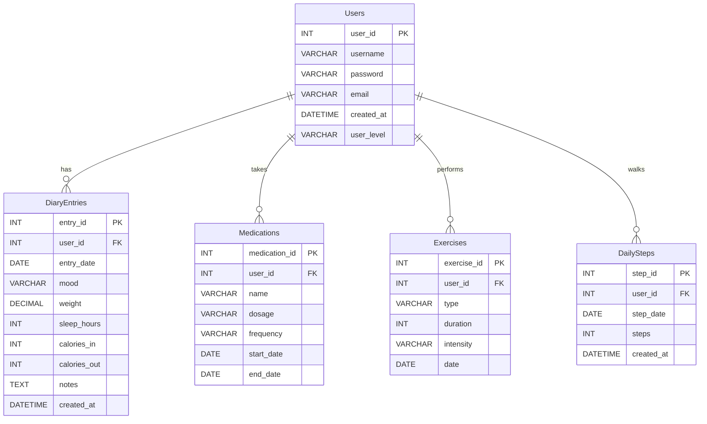

Hyte projektin backend

SQL Database diagrammi

Kuvakaappaukset sivuston käyttöliittymistä:

Toiminnallisuudet:
- Käyttäjän luominen
- käyttäjän sisäänkirjautuminen
- Käyttäjän päiväkirja merkintöjen haku, luominen ja poistaminen
- Käyttäjän BMI-indeksin laskeminen

Ongemat/bugit:
- käyttäjän sisäänkirjautuessa sivu ei automaattisesti päivity joten pitää manuaalisesti refresh sivu jotta käyttäjän tiedot haetaan.

Referenssit:
https://www.w3schools.com/
https://github.com/UllaSe/k2026-hyte-projekti-vite
https://github.com/mattpe/hyte-server-example-26

